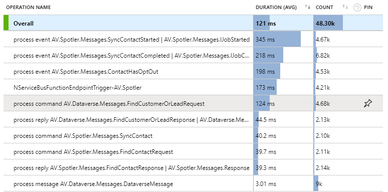
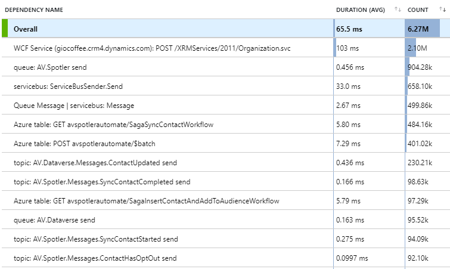
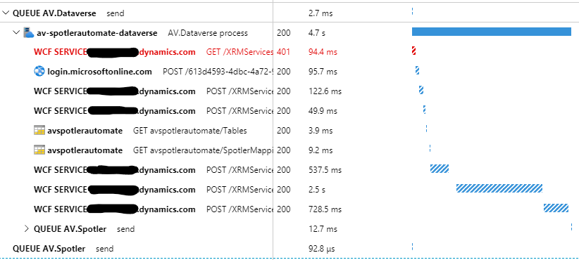
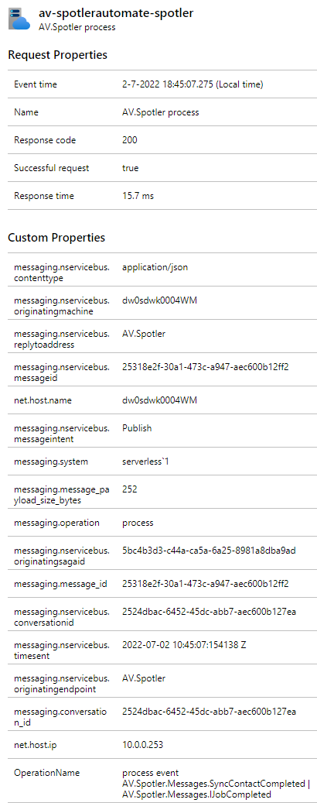

# NServiceBus.Extensions.Diagnostics.ApplicationInsights


[](https://www.nuget.org/packages/NServiceBus.Extensions.Diagnostics.ApplicationInsights)
[](https://www.nuget.org/packages/NServiceBus.Extensions.Diagnostics.ApplicationInsights)

## Usage

This package extends the [NServiceBus.Extensions.Diagnostics](https://www.nuget.org/packages/NServiceBus.Extensions.Diagnostics)
package by exporting the NServiceBus telemetry information to [Application Insights](https://azure.microsoft.com/en-us/services/monitor/).

To use `NServiceBus.Extensions.Diagnostics.ApplicationInsights`, simply reference the package and register the `ITelemetryModule` 
with the `NServiceBusTelemetryModule` as a singleton service.

An example with a Worker Service is shown here:

```csharp
    services.AddSingleton<ITelemetryModule, NServiceBusTelemetryModule>();
    services.AddApplicationInsightsTelemetryWorkerService(opt =>
    {
#if DEBUG
        opt.DeveloperMode = true;
#endif
    });
```

## Application Insights

### Request Telemetry support

For every incoming message in NServiceBus an Application Insights `RequestTelemetry` will be generated. These request will be
generated on message type / each endpoint level, so that you can analyse and monitor how each message type is being handled by an endpoint.  

The operations will be in the form of:

- `process event <message types(s)>` for handling published event messages
- `process command <message types(s)>` for handling command messages
- `process reply <message types(s)>` for handling replies
- `process message <message types(s)>` for other handled messages

Show below is an example how this looks in Application Insights:



### Dependency Telemetry support

For every outgoing message in NServiceBus an Application Insights `DependencyTelemetry` will be generated. These dependencies will
be generated on topic or queue name level. The dependencies will be in the form of:

- `topic: <topic-name> send ` for published event messages
- `queue: <queue-name> send` for sending command messages

Show below is an example how this looks in Application Insights:



In the details of the dependency, you can see the endpoint and the message type of the operation.

### End-to-end insights

The Request and Dependency telemetry will be related by the added W3C transparent and Correlation-Context, generated by the package
[NServiceBus.Extensions.Diagnostics](https://www.nuget.org/packages/NServiceBus.Extensions.Diagnostics). Because of this you can 
see the flow of messages in the Application Insights dashboard.



Also all the NServiceBus (and OpenTelemetry) headers are available as properties in the telemetry. 



## Activity

The `Activity` is being enriched with the NServiceBus context by the package [NServiceBus.Extensions.Diagnostics](https://github.com/jbogard/NServiceBus.Extensions.Diagnostics). 
To see additional configuration options and how you can add your own additional correlation context, like userIDs and sessionIds,
look at the [README](https://github.com/jbogard/NServiceBus.Extensions.Diagnostics/blob/master/README.md) of that package.

This package will then make sure your additional correlation context will be exported to Application Insights.

By default the message contents are not passed to the `Activity`. To enable this, configure the `InstrumentationOptions` setting 
of `NServiceBus.Extensions.Diagnostics` in your `EndpointConfiguration`:

```csharp
var settings = endpointConfiguration.GetSettings();

settings.Set(new NServiceBus.Extensions.Diagnostics.InstrumentationOptions
{
    CaptureMessageBody = true
});
```

This will set a `messaging.message_payload` tag with the UTF8-decoded message body.